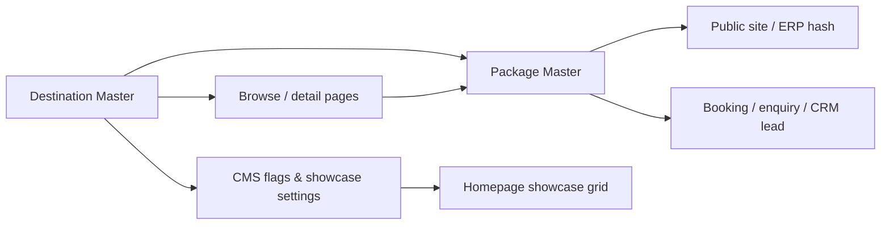

# Phase E3 — Destination Showcase

Premium interactive **Popular Destinations** across ERP admin, CMS, public hash site, and marketing SPA inject. All country lists come from **Destination Master** APIs — never hardcoded on the homepage.

## Lifecycle: Destination → Packages → Booking

1. **Staff** creates destinations in `/#/products/destinations` (code, country, flag, hero, region, categories).
2. **Packages** link to destinations (via `destinationId` on package records when backend supports it; browse/detail aggregate `packageCount` and related packages).
3. **CMS** toggles `homepageFeatured`, `popular`, `featured`, `displayOrder`, and global showcase settings at `/#/cms/destinations`.
4. **Public site** loads `GET /api2/site/destinations?collection=home` + settings on `/#/site` and browse/detail routes.
5. **Marketing SPA** inject (`destinations-home.js`) replaces the “Popular Destinations” / “Where We Can Take You” section with the same API data.
6. **Bookings** continue through existing package enquiry/book flows; destination detail CTAs route to package search or enquire.

## API surface (assumed)

### Staff — `/api2/destinations`

| Method | Path | Purpose |
|--------|------|---------|
| GET | `/destinations` | List/filter (q, status, region, collection flags) |
| POST | `/destinations` | Create master |
| GET | `/destinations/:id` | Get one |
| PATCH | `/destinations/:id` | Update fields & CMS flags |
| DELETE | `/destinations/:id` | Soft delete |
| POST | `/destinations/:id/publish` | Publish |
| POST | `/destinations/:id/unpublish` | Unpublish |
| POST | `/destinations/:id/archive` | Archive |
| GET | `/destinations/showcase-settings` | Global card settings |
| PUT | `/destinations/showcase-settings` | Update settings |

### Public — `/api2/site/destinations`

| Method | Path | Purpose |
|--------|------|---------|
| GET | `/site/destinations?collection=home` | Homepage collection |
| GET | `/site/destinations/browse` | Filters: region, country, category, budgetMaxPoisha |
| GET | `/site/destinations/:slug` | Detail + gallery + packages + related |
| GET | `/site/destinations/settings` | Public showcase settings |

Response shapes follow the packages pattern: `{ data: DestinationMaster[], total }` or bare array.

### DestinationMaster (key fields)

- Identity: `id`, `code`, `name`, `slug`, `status`
- Geo/branding: `countryCode`, `countryName`, `region`, `flagEmoji`, `flagUrl`, `heroImageUrl`
- CMS: `homepageFeatured`, `popular`, `featured`, `displayOrder` / `sortOrder`
- Aggregates: `packageCount`
- Services: `categories[]` — `visa` | `tour` | `hajj` | `air_ticket`

## Frontend modules

| Area | Route / asset | Component |
|------|----------------|-----------|
| Admin | `/#/products/destinations` | `DestinationsListPage` |
| CMS | `/#/cms/destinations` | `CmsDestinationsPage` |
| Site home | `/#/site` | `DestinationShowcaseGrid` on `SiteHomePage` |
| Browse | `/#/site/destinations` | `SiteDestinationsBrowsePage` |
| Detail | `/#/site/destinations/:slug` | `SiteDestinationDetailPage` |
| Marketing | `/assets/destinations-home.js` | Inject for live SPA |
| Figma source | `figma-design/src/pages/Home.tsx` | `DestinationsHomeSection` (React fetch) |

## Lib & clients

- `apps/web/src/lib/destinations.ts` — types, defaults, query builders, `formatPackageCount`
- `apps/web/src/lib/services.ts` — `destinationsApi`, `siteDestinationsApi`
- `apps/web/src/components/destinations/DestinationCard.tsx` — premium card + skeleton
- `apps/web/src/components/destinations/DestinationShowcaseGrid.tsx` — responsive 4/2/1 grid

## Tests

- Unit: `apps/web/tests/unit/destinations.test.ts`
- Smoke: `GET /site/destinations?collection=home` in `tests/api/smoke.mjs`
- E2E: `/#/products/destinations`, `/#/site/destinations` in `tests/e2e/packages.spec.ts`

## Deploy notes

- ERP: `npm run build` in `apps/web`, then `deploy/sync-erp-frontend.sh`
- Marketing: copy `assets/destinations-home.{js,css}` and patch root `index.html` cache-bust query (also `/var/www/ShanghaiTravels/` on live)

## Out of scope (this phase)

- Auth, finance, CRM workflow, and booking case module changes
- Backend implementation (frontend assumes endpoints above)
