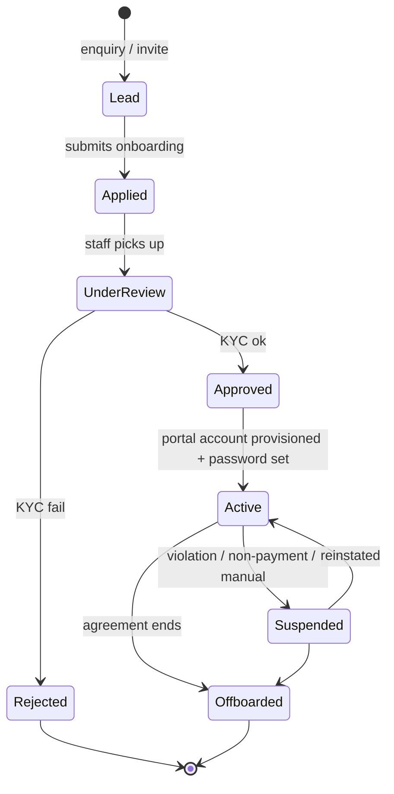
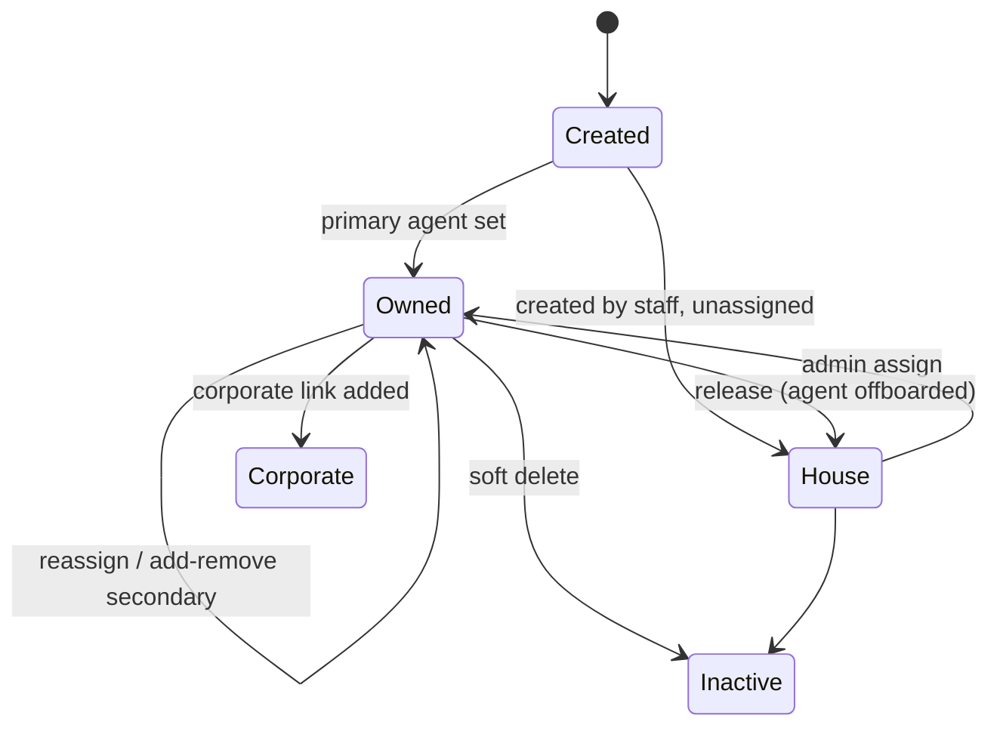
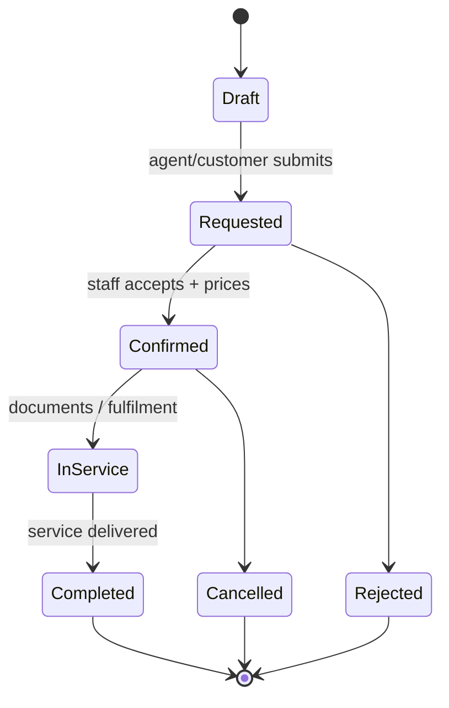
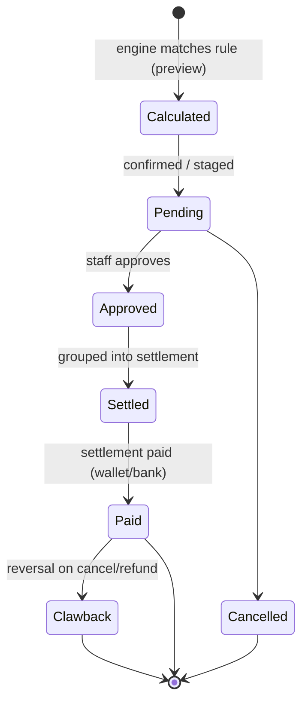
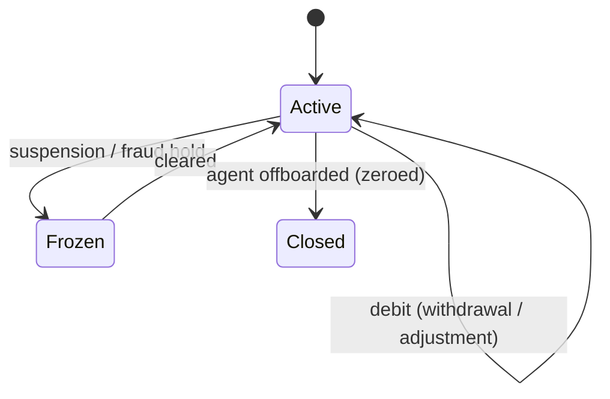

# TravelOS V6 — Agent Platform Business Workflows

## End-to-End Process Specification

**Document:** `docs/V6_AGENT_BUSINESS_WORKFLOW.md`
**Date:** 2026-08-05
**Status:** SPECIFICATION — business workflows only. No code, no migration, no build, no commit produced by this document.
**Series:** third and final pre-implementation document.
- [`docs/V6_AGENT_ARCHITECTURE_REVIEW.md`](./V6_AGENT_ARCHITECTURE_REVIEW.md) — audit (accepted)
- [`docs/V6_AGENT_FOUNDATION.md`](./V6_AGENT_FOUNDATION.md) — permanent data/ownership architecture (accepted)
- **this document** — the business processes those structures serve

**Purpose.** The audit said *what exists*; the foundation said *how the data is shaped*. This document says *how the business actually runs* — every actor, trigger, state transition, decision point, exception path, and handoff. It is the behavioural contract Phase 1–8 implement against. Where a data entity is referenced, see the foundation doc; this document does **not** restate schema.

**Actors (used throughout):**
| Actor | Who | Auth |
|---|---|---|
| **Agent** | B2B travel agent / sub-agent | `st_agent` cookie, agent portal |
| **Customer** | End traveller | `st_portal` cookie, customer portal |
| **Corporate** | Company travel admin | corporate portal |
| **Staff** | Back-office (ops/accounts/managers) | `st_access` cookie + RBAC |
| **System** | Automation/scheduler/engine | service context |

**Money = poisha** (integer minor units, `৳ = /100`). **Delivery is simulation-only** until owner provides Wasender/SMTP creds — every "notify" below enqueues but does not physically send until then.

---

## 1. Agent Lifecycle

The states an agent record moves through, from first contact to offboarding.



| Stage | Trigger | Owner | Key actions | Exit condition |
|---|---|---|---|---|
| **Lead** | Enquiry via site or staff invite | Staff | capture contact | agent submits application |
| **Applied** | Onboarding form (self-serve, optional) or staff-entered | Agent/Staff | collect profile + KYC docs (via OCR/document pipeline), commission tier requested | staff picks up |
| **Under Review** | Application complete | Staff (`agent:manage`) | verify identity/docs, set **tier**, set default commission rule, assign branch | approve / reject |
| **Approved** | Review passes | Staff | create `Agent`, issue **one-time temp password** (portal account) | agent logs in |
| **Active** | First login + forced password change | Agent | full portal access | — |
| **Suspended** | Manual / rule (e.g. wallet fraud, non-payment) | Staff | portal access frozen, bookings blocked, wallet frozen | reinstated / offboarded |
| **Offboarded** | Agreement termination | Staff | portal disabled; **customers released to house** (§6 Assignment); open commissions settled; wallet zeroed via withdrawal/adjustment | archived (soft-delete; history retained) |

**Rules:**
- No self-provisioning of credentials — approval always gates account creation (from foundation §1/§5).
- Suspension is **reversible**; offboarding is terminal but **non-destructive** (records + history retained for audit and commission traceability).
- Offboarding cannot complete while the agent holds a **non-zero wallet balance** or **unsettled commission** — those must be resolved first (guard already exists in spirit today: `agents.service` blocks removing an agent with balance).

---

## 2. Customer Lifecycle



| Stage | Trigger | Ownership result |
|---|---|---|
| **Created (agent portal)** | Agent adds customer | `primaryAgent = creating agent`, `createdBy="agent:<id>"`, assignment history opened |
| **Created (staff)** | Staff adds customer | `primaryAgent = null` → **House account** (or explicitly assigned) |
| **Owned** | Primary agent present | agent + secondary (optional) can view/service per capability matrix (§9) |
| **Corporate-linked** | `corporateClientId` set | corporate portal visibility added *on top of* agent ownership |
| **Reassigned / transferred** | Admin action | primary changes; **historical bookings keep original attribution** (snapshot principle) |
| **Released to House** | Agent offboarded | `primaryAgent = null`, servable by staff, re-assignable |
| **Inactive** | Soft delete | history + ownership records retained |

**Invariant:** a customer is always in exactly one ownership state (Owned / House / Corporate-overlay), always with a complete assignment history, and **house accounts are invisible to all agents** (§7, §9).

---

## 3. Booking Lifecycle

A booking (`Application`) has two independent axes — **for whom** (customer) and **credited to whom** (agent) — and moves through the operational pipeline.



| Stage | Actor | What happens to ownership/commission |
|---|---|---|
| **Draft / Requested** | Agent (portal request model) or Staff (full wizard) | `agentId` **stamped server-side from the authenticated agent** (never from request body); ownership guard verifies the customer belongs to the agent (§9). Walk-in/direct ⇒ `agentId=null` (house booking, no agent commission). |
| **Confirmed** | Staff | pricing set → invoice created (`Invoice.agentId` stamped from booking); commission becomes *calculable* (preview) |
| **In Service** | Staff/Ops | fulfilment; no attribution change |
| **Completed** | Staff | commission calculation **finalised** for approval (§4) |
| **Cancelled / Rejected** | Any/Staff | any pending commission → `cancelled`; if commission already paid, a **clawback adjustment** (§4/§5) is required |

**Conflict handling (from foundation §6), operationalised:**
- Agent books own customer → allowed, `agentId=self`.
- Agent books secondary-owned customer → config: `agentId=primary` (commission to primary) or blocked.
- Agent books another agent's customer → **denied** (ownership guard).
- Customer transferred *after* booking → booking keeps original `agentId`; commission unaffected.

**Immutability rule:** once a commission calculation exists against a booking, its `agentId` is **frozen**. Corrections happen via adjustment, never by rewriting the booking.

---

## 4. Commission Lifecycle

From economic event → earned → approved → settled → paid, with corrections handled as adjustments.



| Stage | Trigger | Actor | Effect |
|---|---|---|---|
| **Calculated (preview)** | Booking confirmed / invoice raised / payment received | System | engine matches the most-specific active `CommissionRule`, snapshots it, computes amount — **proposed, not posted** (default preview mode) |
| **Pending** | Staff confirms (or auto-post config, off by default) | Staff/System | ledger `earn` line written |
| **Approved** | Staff (`commission:manage`) | Staff | eligible for settlement; approval trail recorded |
| **Settled** | Period close / manual batch | Staff | approved lines grouped into a `CommissionSettlement` (the statement unit) |
| **Paid** | Settlement paid | Staff | `CommissionPayment` — via **wallet** (`commission_credit`) or **bank** (external ref) |
| **Clawback** | Booking cancelled/refunded after payment | Staff | `CommissionAdjustment` (negative) → ledger `clawback`; wallet debit if already credited |

**Discipline:** engine runs **preview / manual-confirm** by default (no silent money movement in prod), consistent with V5. Every state change is audited; every calculation carries its rule snapshot so later rule edits never rewrite earned history.

---

## 5. Wallet Lifecycle

The wallet is the agent's money account; balance is the immutable ledger's running total, with the cached balance reconciled.



**Money-in / money-out events:**

| Event | Type | Flow |
|---|---|---|
| **Commission paid** | `commission_credit` | settlement payment → wallet credit (traceable to `CommissionPayment`) |
| **Top-up** | `topup` | agent requests (proof doc via OCR) → **staff approves** → credit posted |
| **Withdrawal** | `withdrawal` | agent requests → **staff approves** → debit posted + bank ref; blocked if `balance − held < amount` |
| **Refund** | `refund` | booking refund routed to agent, or reversal |
| **Adjustment** | `adjustment` | staff correction (signed), always reason + approver |
| **Settlement** | `settlement` | links a commission settlement disbursement |

**Invariants (from foundation §3):** ledger is append-only (corrections = compensating lines), `balance = Σ ledger`, cached balance reconciled by job and **drift surfaced, not auto-fixed**, no negative balance beyond `creditLimit`, every credit traceable to a source. Every transaction and every request decision is audited.

**Request approval sub-workflow (top-up & withdrawal):**
```
Agent submits request (amount [+ proof])  → status: requested
   → Staff reviews (accounts_manager)      → approved / rejected
      → approved → transaction posted        → status: posted/paid  → notify agent
      → rejected → reason recorded            → status: rejected     → notify agent
```

---

## 6. Assignment Workflow

How a customer's ownership is set and moved. (Data model: foundation §1/§5.)

```
Admin ──► Assign ──► Reassign ──► Transfer ──► History ──► Audit
```

| Action | Actor | When | In-flight handling |
|---|---|---|---|
| **Assign** | Staff (`agent:manage`) | house/unowned → primary agent | none (new ownership) |
| **Reassign** | Staff | change primary agent | historical bookings keep old `agentId`; future bookings → new agent |
| **Transfer** | Staff | full handover A→B | choose per transfer: open commissions `keep_with_A` (default) or `move_to_B` (reason + approval); wallet never moves |
| **Add / Remove secondary** | Staff, or primary agent (config) | grant/revoke co-owner | secondary gets view/service, no commission unless a split rule applies (§11) |
| **Release** | Staff | agent offboarded | primary → house |
| **Self-claim** | Agent | — | **not permitted** (agents cannot self-assign others' customers) |

**Rule:** every action writes **both** a `CustomerAssignment` (domain history) **and** an `AuditLog` (compliance) in one transaction — no ownership change without a history row. Both affected agents (and the customer) are notified.

---

## 7. Portal Workflow

Each portal is one lens on the same dataset; server-side scoping enforces visibility.

| Portal | Primary journeys | Cannot do |
|---|---|---|
| **Customer** | view own bookings/invoices/documents, pay, message, manage profile, browse/book packages | see agent/commission/wallet; see other customers |
| **Agent** | dashboard → manage **owned** customers → request bookings → track commission → view wallet & request top-up/withdrawal → statements → notifications → support | see other agents' data; see **house accounts**; charge/edit customers they don't primarily own; self-assign customers |
| **Corporate** | manage company + employees → raise travel requests → approval chain → company bookings/finance/statements | see agent commission/wallet; see non-company customers |
| **Staff** | full back-office: agents, customers, bookings, finance, commission approval, wallet approval, assignment, analytics, leaderboard | (RBAC-scoped by role/branch) |

**Cross-cutting portal rules:** deny-by-default + query scoping on every portal; agents never see other agents' anything; house accounts staff-only; corporate + agent scopes are additive on a shared customer (both enforced server-side).

**Agent portal completeness targets (Phase 7):** add the missing **Profile** page, dedicated **Notifications** page (reusing the shared `NotificationCenter` with an agent-scoped fetcher), and **Statements** download — the three gaps the audit flagged.

---

## 8. Notification Workflow

Event → enqueue → (deliver when live) → in-app read. All targeting is by recipient identity, resolved server-side.

```
Business event ──► NotificationsService.enqueue(recipient, channel, template)
   ──► outbox row (status: pending)
   ──► [delivery adapter]  (simulation-only until creds; then email/whatsapp/sms)
   ──► in-app appears in recipient's NotificationCenter
```

**Agent-facing events to produce (new — none exist today):**
| Event | Recipient | Channel |
|---|---|---|
| Onboarding approved / rejected | Agent | email + in-app |
| Booking status change (confirmed/completed/cancelled) | Agent (+ customer) | in-app |
| Commission approved / paid | Agent | in-app + email |
| Wallet credited (commission/topup/refund) | Agent | in-app |
| Top-up / withdrawal decision | Agent | in-app + email |
| Statement ready | Agent | email |
| Customer assigned / transferred | Both agents | in-app |
| Support reply | Agent | in-app |

**Rules:** notifications carry recipient scope so an agent sees only their own; the shared `NotificationCenter` is reused across portals via a scoped fetcher; **nothing physically sends** until owner provides creds (simulation-only); automation-driven notifications (reminders/statements) are **disabled by default** in prod.

---

## 9. Security Workflow

How "an agent cannot touch another agent's customer" is enforced at runtime (operationalising foundation §4).

```
Agent request ──► AgentJwtGuard (identity)
             ──► Query scoping   (can only SELECT owned rows)
             ──► assertOwnership(agent, customer, capability)  (deny-by-default)
             ──► Server-side attribution stamping (agentId from token, never body)
             ──► AuditLog (actor recorded)
```

| Capability | Own (primary) | Secondary | Other agent's | House |
|---|---|---|---|---|
| Open / view | ✅ | ✅ | ❌ | ❌ |
| Edit | ✅ | ⚠️ config | ❌ | ❌ |
| Book | ✅ | ⚠️ config | ❌ | ❌ |
| Charge (invoice/collect) | ✅ | ❌ | ❌ | ❌ |

**Enforcement principles:**
1. **Three layers** — query scoping (can't even select), mutation guard (`assertOwnership` before every write), attribution stamping (server sets `agentId`). Defense in depth means a bug in one layer doesn't breach.
2. **Deny-by-default** — if ownership can't be proven, reject.
3. **Closes C4** — the package-book path must call the ownership guard (today it trusts a client `customerId`).
4. **Charging is stricter than viewing** — only the *primary* owner can invoice/collect; transfer does not retroactively re-bill.
5. **Every access is audited** with the real actor (agent id), fixing the weak-actor-indexing finding.

---

## 10. Relationship Model

Who relates to whom, and the cardinality that governs visibility and money.

```
                    Branch (1) ──────────────┐
                       │                      │
        Agent (N) ─────┤                      │
          │  │         │                      │
   Tier(1)│  │ owns    │ primary (1)          │
          │  └──────────► Customer (N) ◄───── secondary (0..1) Agent
          │                   │
          │              corporate (0..1) ──► CrmOrganization
          │                   │
          │            Booking/Application (N)  [customerId + agentId]
          │                   │
          │                Invoice (N)  [agentId]
          │                   │
   Wallet(1)◄── commission ── CommissionCalculation (N) ── CommissionRule (N)
          │
   CommissionLedger / Settlement / Payment
```

| Relationship | Cardinality | Governs |
|---|---|---|
| Agent ↔ Tier | N:1 | default commission rules, credit limit |
| Agent ↔ Customer (primary) | 1:N | ownership, commission routing, portal visibility |
| Agent ↔ Customer (secondary) | 0..1:N | co-servicing, optional split |
| Customer ↔ Corporate | N:0..1 | corporate portal visibility overlay |
| Customer ↔ Branch | N:1 | operational scope |
| Booking ↔ Customer / Agent | N:1 / N:1 | two-axis attribution |
| Invoice ↔ Agent | N:0..1 | charging + commission base |
| Agent ↔ Wallet | 1:1 | money account |
| CommissionRule ↔ Calculation | 1:N | policy → earned line (snapshot) |

**Key relational rules:** ownership is **mutable**, booking attribution is **immutable once earned**; wallet belongs to the **agent** (never moves on customer transfer); corporate and agent ownership **coexist** on one customer.

---

## 11. Commission Split Model

How a single commissionable event is divided among parties. Default is **100% to primary**; splits are opt-in via rules.

**Split participants and default shares:**
| Party | Default share | When it changes |
|---|---|---|
| **Primary agent** | 100% | always the baseline earner |
| **Secondary agent** | 0% | a **split rule** grants them a % (co-servicing) |
| **Sub-agent → parent** | per hierarchy rule | a sub-agent's booking yields an **override** slice to the parent agent |
| **Corporate rebate** | 0% | a corporate contract may route a rebate slice to the corporate account |
| **Campaign bonus** | 0% | a campaign rule adds a bonus slice (funded separately, not subtracted from agent) |

**Split resolution order (per commissionable event):**
```
1. Determine gross commission (rule engine, most-specific rule).
2. Apply split policy:
     primaryShare  = gross × primaryPct   (default 100%)
     secondaryShare= gross × secondaryPct  (if secondary + split rule)
     overrideShare = gross × overridePct   (parent agent, hierarchy)
   (shares of the SAME gross must sum ≤ 100%; remainder stays with primary)
3. Campaign bonus is ADDITIVE (separate funding line), not a slice of gross.
4. Each share becomes its own CommissionCalculation line (its own approval,
   ledger entry, settlement, payment) — so every party is independently
   auditable and settleable.
```

**Worked example** (gross ৳1,000 = 100000 poisha, secondary split 20%, parent override 5%, campaign bonus ৳100):
| Party | Basis | Amount |
|---|---|---|
| Primary | 75% of gross | ৳750 |
| Secondary | 20% of gross | ৳200 |
| Parent (override) | 5% of gross | ৳50 |
| Campaign bonus | additive | ৳100 |
| **Total paid out** | | ৳1,100 (৳1,000 gross split three ways + ৳100 bonus) |

**Rules:**
- Splits are **explicit rules**, never implicit; absent a split rule, primary earns 100%.
- Slices of gross must sum ≤ 100%; the remainder always stays with primary (no unallocated commission).
- Bonuses are additive and separately funded (so campaigns don't dilute the agent).
- Each party's slice is an independent calculation → independently approved, clawed back, and settled.

---

## 12. Admin Workflow

What staff do, by role, across the agent platform. (RBAC from foundation/audit: `agent:manage`, `commission:read`, `commission:manage`, `corporate:manage`; `super_admin` bypass.)

| Workflow | Role | Steps |
|---|---|---|
| **Agent onboarding** | `agent:manage` | review application → verify KYC → set tier + default rule + branch → approve → provision account |
| **Agent management** | `agent:manage` | edit profile, set tier, suspend/reinstate, offboard |
| **Assignment** | `agent:manage` | assign/reassign/transfer customers, add/remove secondary, release to house |
| **Commission rules** | `commission:manage` | create/edit rules (scope + basis + effective dates), set splits, activate/deactivate |
| **Commission approval** | `commission:manage` | review calculations → approve/reject → batch into settlements |
| **Commission payment** | `commission:manage` | pay settlements (wallet/bank), handle clawbacks |
| **Wallet approvals** | `commission:manage` (accounts) | approve/reject top-ups & withdrawals, post adjustments, review reconciliation drift |
| **Corporate linkage** | `corporate:manage` | link customers to corporate clients, manage rebate rules |
| **Oversight** | `commission:read` + analytics | agent leaderboard, performance, aging, wallet exposure |

**Separation of duties (target):** the role that *manages agents* (`agent:manage`) and the role that *moves commission money* (`commission:manage`) are distinct — mirroring today's `general_manager` (manages agents, no money actions) vs `accounts_manager` (money actions). Rule changes, approvals, and payments each leave an audit + approval trail.

---

## 13. Operations Workflow

The day-to-day servicing pipeline where agent bookings become delivered travel — how ops interacts with agent attribution.

```
Agent request ──► Ops triage ──► Pricing/Confirm ──► Fulfilment ──► Delivery ──► Close
                      │              │                  │             │           │
                 (verify ownership) (invoice+           (documents/  (service    (commission
                                     agentId stamped)    OCR/visa)    delivered)  finalised)
```

| Stage | Ops action | Agent-platform touchpoint |
|---|---|---|
| **Triage** | Accept/reject incoming agent request | ownership already verified at submission; ops sees `agentId` |
| **Pricing / Confirm** | Quote + confirm booking, raise invoice | `Invoice.agentId` stamped; commission becomes calculable (preview) |
| **Fulfilment** | Process service (visa/ticket/hotel/hajj), collect documents (OCR pipeline available to agents scan-only) | agent watches status in portal; notified on change |
| **Payment** | Collect from customer/agent; refunds | payment can trigger commission (config); refund may trigger clawback |
| **Delivery** | Service delivered | booking → Completed |
| **Close** | Finalise | commission calculation finalised → available for approval; statement period accrues |

**Ops rules:**
- Ops never changes a booking's `agentId` once a commission exists (immutability).
- Cancellations/refunds during ops **feed back** into commission (cancel → pending cancelled; refund-after-pay → clawback).
- Agent-submitted documents flow through the same OCR/human-confirm pipeline as staff-entered ones (agents scan/prefill; staff apply).
- SLA/handoff visibility: every status change enqueues an agent notification (simulation-only until creds).

---

## Cross-Workflow Invariants (the rules that hold everywhere)

1. **Ownership is mutable; attribution is immutable once earned.** Customers can be reassigned; a booking/commission never silently re-routes.
2. **Deny-by-default, server-enforced.** No agent sees or touches another agent's customer, data, wallet, or commission — enforced by query scoping + ownership guard + server-side stamping.
3. **House accounts are staff-only.**
4. **Every money movement is traceable and audited** to a source, with a real actor.
5. **Ledgers are append-only;** corrections are compensating entries, never edits.
6. **No silent money movement in prod** — commission engine runs preview/manual-confirm by default; automation disabled by default.
7. **Delivery is simulation-only** until owner provides Wasender/SMTP credentials.
8. **Every ownership/commission/wallet change writes both domain history and AuditLog** in one transaction.

---

_Business-workflow specification complete. No code, no migration, no build, no commit — per directive. Upon approval of this document, implementation of **V6 Phase 1 — Agent Onboarding** may begin (staging-first, additive schema shown before migrating, reuse-first, per the accepted foundation)._
