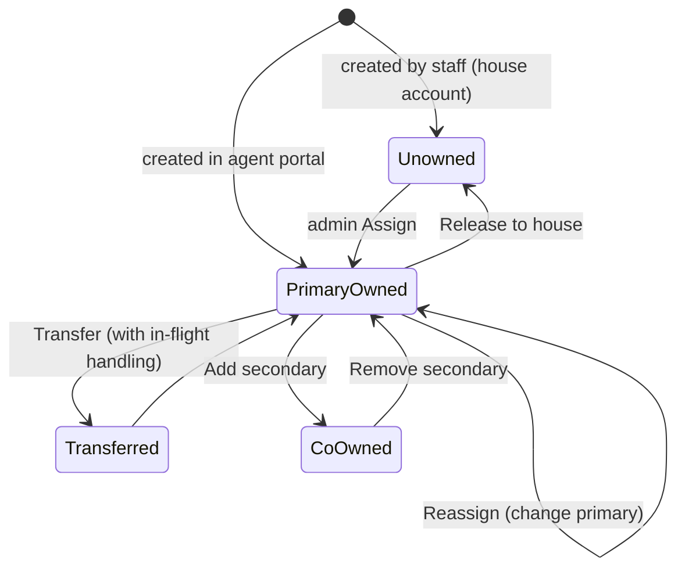

# TravelOS V6 — Agent Platform Architecture Foundation

## Permanent Architecture Proposal

**Document:** `docs/V6_AGENT_FOUNDATION.md`
**Date:** 2026-08-05
**Status:** PROPOSAL — design only. No code, no migration, no build, no commit produced by this document.
**Predecessor:** [`docs/V6_AGENT_ARCHITECTURE_REVIEW.md`](./V6_AGENT_ARCHITECTURE_REVIEW.md) (accepted). This document defines the **permanent data & ownership architecture** that Phases 1–8 will build against — the contract that must be right *once*, because everything (commission, wallet, statements, analytics) rests on it.

**Conventions used throughout:**
- **Money = integer minor units (poisha).** `৳ = value / 100`. Every amount below is an `Int` in poisha, matching the current codebase.
- Backend source-of-truth is `/opt/shanghai-erp-api/src` + Prisma `schema.prisma`. All schema shown is **additive** (new models / new nullable columns) unless explicitly flagged; nothing here drops or rewrites existing columns.
- **Attribution is FK-based, deny-by-default.** The current string conventions (`Customer.createdBy = "agent:<id>"`, loose `Application.agentId String`) are *replaced by real foreign keys* and kept only as migration inputs.
- Design principle: **snapshot at the moment of economic truth.** Ownership can change over time; a booking's commission attribution must not silently move with it. Historical records carry the agent they were *created under*; current ownership is a separate, mutable pointer.

---

## 1. Customer Ownership

### 1.1 The ownership chain

```
                    Customer
                       │
        ┌──────────────┼───────────────┐
        │              │               │
   Primary Agent   Branch          Corporate Owner (optional)
        │              │               │
   Secondary Agent     │          (CrmOrganization / corporate client)
   (optional)          │
        │              │
        └──────► Ownership record ◄─────┘
                       │
     ┌─────────────────┼──────────────────┐
  Created By      Assigned By        Assignment History
  (immutable)     (mutable, current)  (append-only audit trail)
```

Every customer resolves to **exactly one current ownership state** plus a full history. The eight elements of the chain:

| Element | Meaning | Storage (proposed) | Mutable? |
|---|---|---|---|
| **Primary Agent** | The one agent economically responsible for this customer; commission default routes here. `null` = **house account** (staff/direct-owned). | `Customer.primaryAgentId` → FK `Agent` (nullable) | Yes (via assignment) |
| **Secondary Agent** | Optional co-owner with *read + service* rights but **no commission by default** (e.g. a servicing sub-agent). | `Customer.secondaryAgentId` → FK `Agent` (nullable) | Yes |
| **Corporate Owner** | Optional: the customer is an employee/traveller of a corporate client. | `Customer.corporateClientId` → FK (align with existing `CrmOrganization`/corporate) | Yes |
| **Branch** | Physical/operational branch scope (already exists). | `Customer.branchId` (existing) | Rarely |
| **Created By** | Immutable record of who first created the customer (staff user id or `agent:<id>`). Already exists as a string. | `Customer.createdBy` (existing, kept) | **No** |
| **Assigned By** | Who set the *current* primary agent (staff user or system on self-serve). | `Customer.assignedById` → FK `User` (nullable) | Yes |
| **Assignment History** | Append-only log of every ownership change. | New model `CustomerAssignment` | Append-only |

> **Why both `createdBy` (immutable) and `primaryAgentId` (mutable):** `createdBy` answers "who originated this record" (never changes, needed for backfill + audit); `primaryAgentId` answers "who owns it *now*" (changes on transfer). Conflating them is the root cause of today's derived-ownership fragility.

### 1.2 New model — `CustomerAssignment` (assignment history)

| Field | Type | Notes |
|---|---|---|
| `id` | String @id | |
| `customerId` | FK `Customer` | |
| `fromAgentId` | FK `Agent`? | null on first assignment / from house |
| `toAgentId` | FK `Agent`? | null when moved to house |
| `role` | enum `AssignmentRole` | `primary` \| `secondary` |
| `action` | enum `AssignmentAction` | `assign` \| `reassign` \| `transfer` \| `release` \| `add_secondary` \| `remove_secondary` |
| `reason` | String? | free text / ticket ref |
| `assignedById` | FK `User`? | staff actor (null if system/self-serve) |
| `actorAgentId` | FK `Agent`? | agent actor, if agent-initiated |
| `effectiveAt` | DateTime | when it takes effect |
| `createdAt` | DateTime | |

Every mutation of `primaryAgentId`/`secondaryAgentId` **must** write one `CustomerAssignment` row **and** an `AuditLog` entry, inside the same transaction. No ownership change without a history row — enforced in the ownership service, not left to callers.

### 1.3 Complete ownership lifecycle



1. **Creation.**
   - *Agent portal path:* `primaryAgentId = creating agent`, `createdBy = "agent:<id>"`, `assignedById = null`, one `CustomerAssignment(action=assign, toAgent=creator)`.
   - *Staff path:* `primaryAgentId = null` (house account) unless staff explicitly assigns; `createdBy = "<staffUserId>"`.
2. **Assignment.** Admin assigns an unowned/house customer to a primary agent → sets `primaryAgentId`, `assignedById`, writes history + audit.
3. **Reassignment.** Admin changes the primary agent → history `reassign`, in-flight bookings/commissions handled per §5.3.
4. **Transfer.** Full handover (primary + optionally secondary + open commissions) → history `transfer`; see §5.
5. **Secondary add/remove.** Grants/revokes a co-owning servicing agent (read+service, no commission unless a rule says so).
6. **Corporate link.** Setting `corporateClientId` marks the customer as corporate-owned; corporate portal visibility rules (§7) then apply *in addition to* agent ownership.
7. **Release to house.** `primaryAgentId → null` (e.g. agent offboarded) — history `release`. House customers are servable by staff and re-assignable.
8. **Deactivation.** Soft-delete of the customer never deletes history; ownership records persist for audit and commission traceability.

---

## 2. Commission Engine

The engine separates **rule** (policy), **calculation** (a computed line snapshotting the rule), **ledger** (the running account of earned amounts), **settlement** (grouping lines for payout), **payment** (actual disbursement), plus **adjustment**, **approval**, and **history** as first-class records. This mirrors how a commercial travel ERP keeps commission auditable and reconcilable.

### 2.1 Entity map

```
CommissionRule ──(matched & snapshotted by)──► CommissionCalculation ──(posts a line to)──► CommissionLedger
                                                        │                                        │
                                                CommissionApproval                       CommissionSettlement
                                                        │                                        │
                                                CommissionAdjustment                     CommissionPayment
                                                        │                                        │
                                                        └──────────► CommissionHistory ◄─────────┘
```

### 2.2 `CommissionRule` — the policy

Rules are **scoped, dimensioned, effective-dated, and prioritised**. The engine picks the single most-specific active rule (or a documented stacking policy) per calculable event.

| Field | Type | Notes |
|---|---|---|
| `id` | String @id | |
| `name` | String | |
| `active` | Boolean | |
| `priority` | Int | higher wins on tie; explicit precedence |
| `basis` | enum `CommissionBasis` | `fixed` \| `percentage` \| `slab` |
| `value` | Int | poisha (fixed) or basis-points (percentage) |
| `slabs` | Json? | for `slab`: `[{ minAmount, maxAmount, basis, value }]` |
| **Scope dimensions** (all nullable; null = "any") | | a rule matches when every non-null dimension matches the event |
| `agentId` | FK `Agent`? | per-agent override |
| `agentTierId` | FK `AgentTier`? | per-tier |
| `serviceType` | String? | **Per Service** (visa/ticketing/hotel/transport/tour/hajj/…) |
| `countryCode` | String? | **Per Country** (destination) |
| `packageId` | FK `PackageMaster`? | **Per Package** |
| `airlineCode` | String? | **Per Airline** |
| `hotelId` | String? | **Per Hotel** |
| `corporateClientId` | String? | **Per Corporate** |
| `campaignId` | String? | **Per Campaign** |
| `branchId` | String? | branch-scoped rule |
| `effectiveFrom` / `effectiveTo` | DateTime? | effective dating |
| `createdBy` / `createdAt` / `updatedAt` | | |

**Precedence (most-specific-wins).** When multiple active, in-date rules match an event, resolve by: (1) explicit `priority` desc; then (2) specificity score = count of non-null scope dimensions (agent > tier > package > airline/hotel > corporate > country > service > branch > global); then (3) newest `effectiveFrom`. The chosen rule id + resolved specificity is **snapshotted** into the calculation so a later rule edit never rewrites history.

**The nine commission modes, expressed as `(basis × scope)`:**

| Mode requested | How it's expressed |
|---|---|
| **Fixed** | `basis=fixed`, `value=poisha` |
| **Percentage** | `basis=percentage`, `value=bps` (this is where `Agent.commissionRateBps` / `PackageMaster.agentCommissionBps` finally get *used* — as seed values for percentage rules) |
| **Per Service** | scope `serviceType` |
| **Per Country** | scope `countryCode` |
| **Per Package** | scope `packageId` |
| **Per Airline** | scope `airlineCode` |
| **Per Hotel** | scope `hotelId` |
| **Per Corporate** | scope `corporateClientId` |
| **Per Campaign** | scope `campaignId` |

Any mode combines with any basis (e.g. "Per Airline, percentage 2%", "Per Package, fixed ৳1,500", "Per Corporate, slab").

### 2.3 `CommissionCalculation` — the computed line (snapshot)

The immutable record of "rule R applied to event E produced amount A." Replaces today's manual hand-typed amount.

| Field | Type | Notes |
|---|---|---|
| `id` | String @id | |
| `agentId` | FK `Agent` | earner |
| `applicationId` | **FK** `Application` | **enforced FK** (today: loose string) |
| `invoiceId` | **FK** `Invoice`? | when tied to invoice/payment |
| `paymentId` | FK `Payment`? | when commission triggers on payment receipt |
| `ruleId` | FK `CommissionRule`? | the rule that matched (null = manual) |
| `ruleSnapshot` | Json | frozen `{basis, value, scope, specificity}` |
| `baseAmount` | Int | the amount the % applied to (e.g. service revenue) |
| `computedAmount` | Int | poisha earned |
| `trigger` | enum | `on_booking` \| `on_invoice` \| `on_payment` \| `manual` |
| `status` | enum `CommissionStatus` | reuse existing: `pending`→`approved`→`paid`→`cancelled` |
| `createdBy` / `createdAt` | | `system` when engine-generated |

> **Trigger policy (discipline):** by default the engine runs in **preview / manual-confirm** mode — it *proposes* calculations that staff approve — consistent with the V5 "no auto-post in prod" rule. Auto-posting on payment is a config flag, off by default.

### 2.4 `CommissionLedger` — the running account

Append-only per-agent ledger of commission movements (earned, adjusted, settled, clawed back), each with a running balance snapshot. Distinct from the **Wallet** ledger (§3): the commission ledger tracks *what the agent is owed*; when a commission is **paid**, it moves value into the **wallet** as a `commission_credit`.

| Field | Type |
|---|---|
| `id`, `agentId` FK, `calculationId` FK?, `adjustmentId` FK?, `settlementId` FK? |
| `entryType` enum: `earn` \| `adjust` \| `settle` \| `clawback` \| `cancel` |
| `amount` Int (signed poisha), `runningBalance` Int (snapshot), `memo`, `createdBy`, `createdAt` |

### 2.5 Settlement, Payment, Adjustment, Approval, History

- **`CommissionSettlement`** — groups approved calculations into one payout batch: `{ id, agentId, periodFrom, periodTo, totalAmount, status(open|approved|paid|void), lineCount, createdBy }`. A settlement is what an **agent statement** (§Phase 6) renders.
- **`CommissionPayment`** — the actual disbursement of a settlement: `{ id, settlementId, method(wallet|bank|adjustment), amount, reference, walletTxnId?, paidBy, paidAt }`. `method=wallet` posts a `commission_credit` wallet txn (reusing today's `postWallet`); `method=bank` records an external reference.
- **`CommissionAdjustment`** — corrections & clawbacks: `{ id, agentId, calculationId?, amount(signed), type(correction|clawback|bonus|penalty), reason, approvedBy, createdAt }`. Posts an `adjust`/`clawback` ledger entry.
- **`CommissionApproval`** — approval trail for calculations/settlements: `{ id, targetType(calculation|settlement|adjustment), targetId, decision(approved|rejected), decidedBy, note, decidedAt }`. Keeps the current `commission:manage` permission gate.
- **`CommissionHistory`** — a unified event log (status transitions, rule matches, approvals, payments) for one calculation/settlement, so a single view reconstructs the full life of any commission (complements `AuditLog`).

### 2.6 Relationship to existing `Commission` model

The current `Commission` table (manual, `pending→approved→paid`) is **preserved and reframed** as the calculation record — extended with the FK/rule/snapshot fields above. `CommissionStatus` enum is reused unchanged. Existing rows migrate as `trigger=manual, ruleId=null` (§8).

---

## 3. Wallet Architecture

The wallet becomes a **fundable, reconcilable account** backed by an immutable ledger, while keeping the fast denormalized balance the app already reads.

### 3.1 Entity map

```
Wallet (1 per agent)
  ├── WalletTransaction   (an operation: topup / withdrawal / commission_credit / adjustment / refund / settlement)
  │        └── WalletLedger (immutable posting lines w/ running balance)   ← source of truth for balance
  ├── WalletTopupRequest  (agent-initiated funding, needs approval)
  ├── WalletWithdrawalRequest (agent-initiated payout, needs approval)
  └── Running Balance = Σ WalletLedger.amount  (reconciled against Wallet.cachedBalance)
```

### 3.2 Every entity explained

| Entity | Purpose | Key fields |
|---|---|---|
| **`Wallet`** | One account per agent. Today this is just `Agent.walletBalance`; promote to a real entity (or keep the cached column *and* add a Wallet row) so it can hold currency, credit limit, holds. | `agentId` FK unique, `cachedBalance` Int, `creditLimit` Int=0, `heldAmount` Int=0, `currency="BDT"`, `status(active|frozen)` |
| **`WalletTransaction`** | The header for one economic operation. Replaces the flat `AgentWalletTxn`. | `id`, `walletId` FK, `type WalletTxnType`, `direction(credit|debit)`, `amount` Int (always positive; `direction` decides sign), `relatedType`/`relatedId`, `memo`, `status(pending|posted|void)`, `createdBy`, `createdAt` |
| **`WalletLedger`** | **Immutable, append-only** posting lines — the true source of balance. Every posted transaction writes exactly one ledger line with the running balance snapshot. | `id`, `walletId` FK, `transactionId` FK, `amount` Int (signed poisha), `runningBalance` Int (snapshot), `createdAt` |
| **`Settlement`** | Ties a `CommissionSettlement` payout into the wallet when paid via wallet. | reference from `CommissionPayment.walletTxnId` |
| **`WalletWithdrawalRequest`** | Agent asks to cash out. Approval → posts a `withdrawal` debit. | `id`, `walletId`, `amount`, `method(bank|cash|adjustment)`, `status(requested|approved|rejected|paid)`, `requestedByAgentId`, `decidedBy`, `bankRef`, timestamps |
| **`WalletTopupRequest`** | Agent adds funds (e.g. deposit proof via OCR/documents). Approval → posts a `topup` credit. | `id`, `walletId`, `amount`, `proofDocumentId?`, `status(requested|approved|rejected|posted)`, `requestedByAgentId`, `decidedBy`, timestamps |
| **`Adjustment`** | Staff correction (`WalletTxnType=adjustment`), signed, always reason + approver. | via `WalletTransaction(type=adjustment)` |
| **`Refund`** | Money returned into/out of the wallet (e.g. booking refund credited to agent, or reversal). New `WalletTxnType=refund`. | via `WalletTransaction(type=refund)` |
| **`Running Balance`** | `Σ WalletLedger.amount`. `Wallet.cachedBalance` is a denormalized mirror; a **reconciliation job** recomputes and flags/repairs any drift (writing an `adjustment` if a discrepancy is confirmed). Balance is *never* trusted from the cache alone for money-moving operations. | derived |
| **`Audit`** | Every wallet transaction + every request decision writes an `AuditLog` row (actor = staff user or agent). No silent balance mutation. | `AuditLog` |

**Proposed `WalletTxnType` (extended):** `commission_credit`, `withdrawal`, `adjustment`, **`topup`** (new), **`refund`** (new), **`settlement`** (new). Today's enum has only the first three.

### 3.3 Invariants

1. **Ledger is immutable.** Corrections happen by posting a compensating line, never by editing history.
2. **Balance = Σ ledger.** `cachedBalance` exists only for speed and is reconciled; money operations re-read/lock the wallet row.
3. **No negative balance** unless within `creditLimit`; withdrawals check `cachedBalance − heldAmount ≥ amount`.
4. **Every credit is traceable** to a source (`commission_credit → CommissionPayment`, `topup → WalletTopupRequest`, `refund → Payment/booking`).

---

## 4. Customer Ownership Security

**Threat:** an agent opening, editing, booking for, or charging **another agent's customer**. Today this is only partly prevented (the case path checks; the package path `packages.service.agentBook:861` does **not**), and it rests on inferred string ownership.

### 4.1 The single enforcement point

All agent-scoped access flows through **one server-side ownership service** — `AgentOwnershipGuard` / `assertOwnership(actorAgentId, customerId, capability)` — and **no agent controller may touch a customer/booking/invoice without it**. Deny-by-default: if ownership can't be proven, the request is rejected.

Ownership is proven **by FK**, not by string inference:

```
canAccess(agent, customer, capability) =
    customer.primaryAgentId   == agent.id                      (full)
 OR customer.secondaryAgentId == agent.id  AND capability ∈ {open, service}   (limited)
 OR (customer is corporate AND agent is that corporate's linked agent)         (corp)
 -- house accounts (primaryAgentId == null) are NEVER visible to any agent
```

### 4.2 Capability matrix (agent → another agent's customer)

| Capability | Own (primary) | Secondary | Another agent's | House |
|---|---|---|---|---|
| **Open / view** | ✅ | ✅ | ❌ | ❌ |
| **Edit** (profile/passport) | ✅ | ⚠️ configurable | ❌ | ❌ |
| **Book** (create Application) | ✅ | ⚠️ configurable | ❌ | ❌ |
| **Charge** (invoice/collect) | ✅ | ❌ | ❌ | ❌ |

### 4.3 Defense in depth (three layers)

1. **Query scoping.** Every agent-portal list/read query is filtered by the ownership predicate at the DB level (e.g. `where primaryAgentId = :agent OR secondaryAgentId = :agent`). An agent literally cannot *select* another agent's customer.
2. **Mutation guard.** Every create/update/book/charge calls `assertOwnership(...)` before writing. **This closes C4** — `agentBook` must call it and reject a `customerId` the agent doesn't own (matching what `createCase` already does).
3. **Attribution stamping.** On booking/charge, `agentId`/`primaryAgentId` is stamped **server-side from the authenticated agent**, never trusted from the request body.

### 4.4 "Charging" specifically

An agent may only create an invoice / take a payment against a customer they *primarily* own. Invoices gain an `agentId` (§6) stamped from ownership at creation; a later ownership transfer does **not** retroactively re-bill — the invoice keeps its original agent for commission integrity.

---

## 5. Assignment Workflow

```
Admin ──► Assign Agent ──► Reassign ──► Transfer ──► History ──► Audit
```

### 5.1 Actions & authority

| Action | Who | Effect | Guard |
|---|---|---|---|
| **Assign** | Admin/staff (`agent:manage`) | house/unowned customer → primary agent | ownership service |
| **Reassign** | Admin (`agent:manage`) | change primary agent | history + audit |
| **Transfer** | Admin (`agent:manage`) | move primary (+ optionally secondary + open commissions) between agents | in-flight policy §5.3 |
| **Add/Remove secondary** | Admin, or primary agent (config) | grant/revoke co-owner | history |
| **Release** | Admin | primary → house (e.g. offboarding) | history |
| **Self-serve claim** | — | not permitted by default (agents cannot self-assign others' customers) | denied |

### 5.2 Every step is recorded

Each action writes **both** a `CustomerAssignment` row (domain history) **and** an `AuditLog` row (compliance), in one transaction. The assignment history is queryable per-customer and per-agent (feeds the agent statement + analytics).

### 5.3 In-flight handling on reassign/transfer (the hard part)

When a customer moves from Agent A → Agent B:
- **Historical bookings** keep `Application.agentId = A` (attribution is snapshotted; A earned them).
- **Open/unpaid commissions** — policy choice, set per transfer: `keep_with_A` (default, A keeps earned commission) or `move_to_B` (rare, requires reason + approval). Recorded on the `CustomerAssignment`.
- **Future bookings** attribute to B.
- **Wallet balances** never move on transfer (wallet belongs to the agent, not the customer).
- Customer + both agents receive a notification (once delivery is live); until then, simulation-only.

---

## 6. Booking Ownership

**A booking belongs to the Customer AND the Agent.** These are two independent axes:
- **Customer axis:** `Application.customerId` — *who the booking is for*.
- **Agent axis:** `Application.agentId` — *who gets credit/commission* — promoted to an **enforced FK** to `Agent` (today it's a loose `String?`).

### 6.1 Stamping rule

At creation the agent axis is stamped **server-side** from the authenticated agent (portal) or chosen explicitly by staff (back-office). It is **immutable for commission purposes** once a commission calculation exists against it.

### 6.2 Conflict handling

| Situation | Resolution |
|---|---|
| Agent books for a customer they **primarily own** | ✅ allowed; `agentId = actor` |
| Agent books for a **secondary-owned** customer | ⚠️ config: allowed with `agentId = primary` (commission to primary) or blocked |
| Agent books for a customer owned by **another agent** | ❌ denied (ownership guard, §4) — closes C4 |
| **Staff** books for an agent-owned customer | ✅ staff sets `agentId` explicitly (defaults to customer's `primaryAgentId`) |
| Customer's ownership **transfers after** booking | booking keeps original `agentId`; commission unaffected (snapshot) |
| **Corporate** customer booked by their linked agent | ✅ `agentId = linked agent`, `corporateClientId` also stamped |
| Booking created **without** an agent (walk-in/direct) | `agentId = null` → house booking, no agent commission |

**Principle:** *ownership of the customer is mutable; attribution of a booking is immutable.* This prevents commission from silently re-routing when customers are reassigned, and prevents disputes.

---

## 7. Portal Behaviour (visibility rules)

One dataset, four lenses. Visibility is enforced server-side (query scoping), never client-side.

| Data | **Customer portal** | **Agent portal** | **Corporate portal** | **Staff (back-office)** |
|---|---|---|---|---|
| **Own profile** | own record | own agent profile | company + employees | all |
| **Customers** | self only | customers where agent is primary/secondary; **house accounts hidden** | employees of the company | all (branch-scoped by role) |
| **Bookings** | own bookings | bookings where `agentId = self` (+ secondary-owned, config) | company travel requests + bookings | all |
| **Invoices/Finance** | own invoices | invoices for owned customers where `agentId = self` | company invoices | all |
| **Commission** | ❌ never | own calculations/ledger/settlements/statements | ❌ | all agents (`commission:read`) |
| **Wallet** | ❌ | own wallet + requests | ❌ | all agents (`commission:manage`) |
| **Notifications** | own | own (shared `NotificationCenter` + agent-scoped fetcher) | company | all |
| **Analytics** | ❌ | **own performance only** (own conversion/revenue/commission) — never other agents' | company aggregate | all agents / leaderboard |
| **Documents/OCR** | own | scan + own-customer docs | company | all |

**Cross-cutting rules:**
1. **Deny-by-default + query scoping** (§4.3) applies to *every* portal, not just agent.
2. **House accounts** (`primaryAgentId = null`) are invisible to all agents — only staff see them.
3. **Agents never see other agents' data** — not customers, commission, wallet, or analytics. Leaderboard visibility (if any) is aggregate/anonymised or staff-only.
4. **Corporate + agent can co-exist** on one customer: corporate portal sees it via `corporateClientId`; the linked agent sees it via `primaryAgentId`; both scopes are additive, both enforced server-side.

---

## 8. Migration Strategy

**Goal:** move from *inferred string ownership* to *FK ownership* with **zero data loss**, reversibly, on staging first. The migration is **additive then backfill then cutover** — existing columns are never dropped in the same step that adds their replacement.

### 8.1 Principles
- **Additive schema first.** Add all new nullable columns/models (`primaryAgentId`, `secondaryAgentId`, `assignedById`, `CustomerAssignment`, commission/wallet models, `Application.agent` relation, `Invoice.agentId`) — nothing existing changes yet. App keeps running on the old derived logic.
- **Backfill from the current truth.** The existing derivation *is* the migration input: `agent-portal.service.ts:49-60`.
- **Dual-read during transition.** For one release the ownership service reads FK **if present**, else falls back to the derived rule — so partial backfill is safe.
- **Cutover + verify, then retire the fallback.** Only after reconciliation counts match do we make FK authoritative.
- **Reversible.** New columns nullable + history append-only ⇒ rollback = stop reading FKs; no destructive change to un-wind.

### 8.2 Existing **customers** → ownership

1. Add `Customer.primaryAgentId`, `secondaryAgentId`, `assignedById` (nullable) + `CustomerAssignment`.
2. Backfill `primaryAgentId` per customer using the current rule, in priority order:
   - **(a)** if `Customer.createdBy = "agent:<id>"` and that agent exists → `primaryAgentId = <id>`;
   - **(b)** else if the customer has Applications with a single distinct `Application.agentId` → that agent;
   - **(c)** else if multiple distinct agents → pick the most recent/most-frequent as primary, **record the ambiguity** for staff review (report, not guess silently);
   - **(d)** else → `null` (house account).
3. For every backfilled owner, write a `CustomerAssignment(action=assign, toAgent=..., reason="migration-backfill", effectiveAt=createdAt)` so history starts complete.
4. Produce a **migration report**: counts per branch (owned/house/ambiguous), and the ambiguous list for manual resolution. No silent truncation.

### 8.3 Existing **bookings** → FK attribution

1. Add the `Application.agent` **relation** alongside the existing `agentId String?` (keep the column, add the FK constraint as a *validated-not-enforced* step first, then enforce after cleaning orphans).
2. Detect orphans: `Application.agentId` values with no matching `Agent` → report + null them (or map via a staff-provided crosswalk). Never delete the application.
3. `Invoice.agentId` (new, nullable): backfill from `Invoice → Application.agentId`; leave null where no application.
4. Bookings retain their existing `agentId` verbatim — **attribution is preserved exactly** (no re-derivation), honouring the snapshot principle.

### 8.4 Existing **agents** → identity/tier/wallet

1. `Agent.status String` → introduce `AgentStatus` enum (`pending|active|suspended|rejected`); backfill `active`→`active`, `suspended`→`suspended`, unknown→`active` with a flag.
2. Add `AgentTier` + `Agent.tierId` (nullable); assign all existing agents a **default tier** (no behavioural change — default tier's rules reproduce today's flat `commissionRateBps`).
3. **Wallet:** create one `Wallet` per agent with `cachedBalance = Agent.walletBalance` (verbatim). Backfill `WalletLedger` from existing `AgentWalletTxn` rows in chronological order, computing `runningBalance`; **reconcile** the final running balance against `Agent.walletBalance` and report any drift (do **not** auto-fix — surface for staff, since a drift means today's cache is already wrong).
4. **Commissions:** existing `Commission` rows migrate in place as `trigger=manual, ruleId=null, ruleSnapshot=null`; their `pending/approved/paid` status is preserved; add ledger lines mirroring their current state so the new `CommissionLedger` opens balanced.
5. Seed **`CommissionRule`** from existing rate fields: one percentage rule per agent from `Agent.commissionRateBps` (where >0), and per-package rules from `PackageMaster.agentCommissionBps` — so day-one behaviour equals today's *intended* (but currently unused) rates. Flag this as a **behaviour change to confirm with the owner** (today those rates do nothing; activating them changes payouts).

### 8.5 Ordering & safety
- Run on **staging (`st_erp_staging`) first**, verify reconciliation reports, then owner-gated prod.
- Each backfill is **idempotent** (re-runnable) and wrapped per-branch so a failure is isolated.
- Keep the derived-ownership code path until the dual-read window closes; retire it in a later, separate change.
- **No delivery side-effects** during migration (no notifications fire); simulation-only remains in force.

### 8.6 What could go wrong (and the guard)

| Risk | Guard |
|---|---|
| Ambiguous ownership (multi-agent customers) | report + manual resolution, never silent pick |
| Wallet cache already drifted from txns | reconcile + surface, don't auto-fix |
| Orphan `agentId` on applications | crosswalk or null + report, never delete |
| Activating unused commission rates changes money | seeded rules flagged for explicit owner sign-off |
| Partial backfill | dual-read fallback keeps app correct mid-migration |

---

## Appendix — New/changed schema at a glance (proposal)

**New models:** `CustomerAssignment`, `AgentTier`, `CommissionRule`, `CommissionCalculation` (or extended `Commission`), `CommissionLedger`, `CommissionSettlement`, `CommissionPayment`, `CommissionAdjustment`, `CommissionApproval`, `CommissionHistory`, `Wallet`, `WalletTransaction` (replacing/wrapping `AgentWalletTxn`), `WalletLedger`, `WalletTopupRequest`, `WalletWithdrawalRequest`.

**New columns (additive, nullable):** `Customer.primaryAgentId`, `Customer.secondaryAgentId`, `Customer.assignedById`; `Application.agent` relation on existing `agentId`; `Invoice.agentId`; `Agent.tierId`; enum-ify `Agent.status`.

**New enum values:** `WalletTxnType += topup, refund, settlement`; `AgentStatus (new)`; `AssignmentRole`, `AssignmentAction`, `CommissionBasis` (new).

**Reused unchanged:** `CommissionStatus`, `AuditLog`, `LedgerEntry` (company GL stays separate from wallet), poisha money convention, `commission:manage`/`agent:manage`/`commission:read` permissions, `NotificationCenter` `fetcher` seam, `PdfService.renderStatement(partyType:"Agent")`.

---

_Foundation proposal complete. No code, no migration, no build, no commit — per directive. Next action: owner review/approval of this architecture before Phase 1 (Agent Onboarding) implementation begins._
